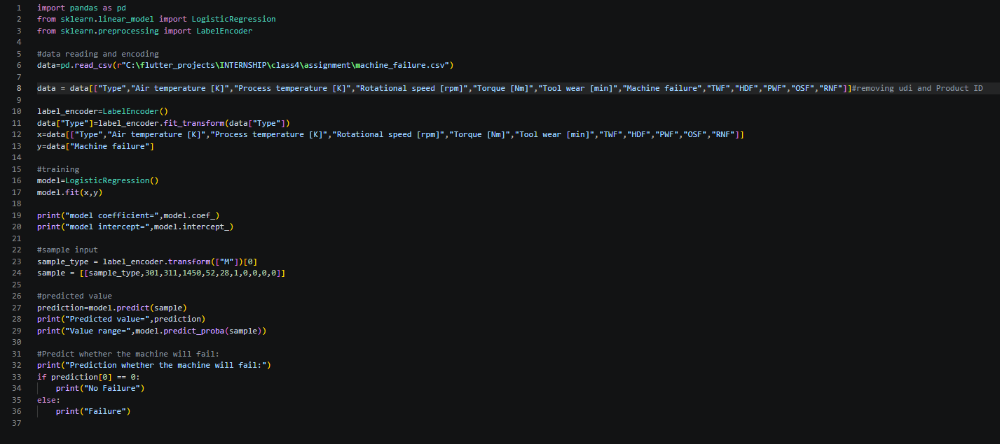
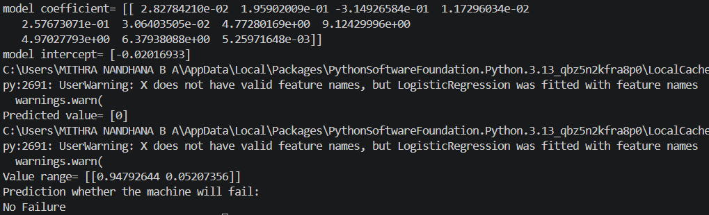

# Assignment4-Logistic-Regression
Assignment 4 about Logistic Regression by Mithra Nandhana B A

## Problem Statement
A smart manufacturing company wants to predict whether a machine will fail based on machine operating conditions and failure indicators.

## Answer
The code is saved in the `assignment4-logistic-regression/assignment/logistic_regression.py/` along with the csv file containing the data.

The code and the output are given below.

## *Code*

## *Output*

## Final Answer
Predicted value= [0]
Prediction whether the machine will fail:
No Failure

# What I Learned
By this assignment and class, I learned:
1. Logistic Regression Model

:D
